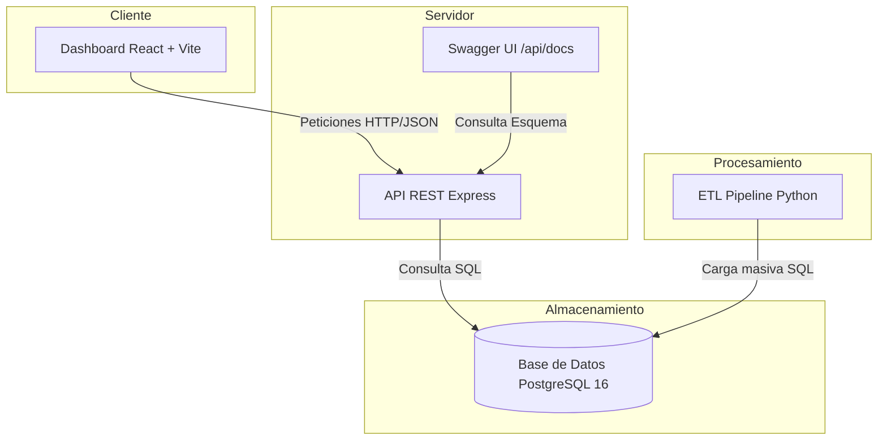
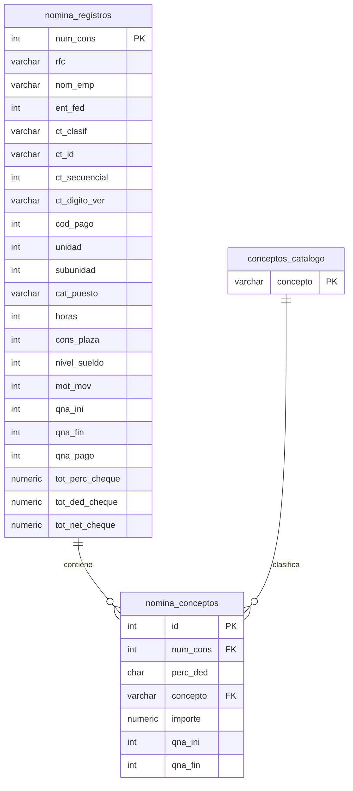
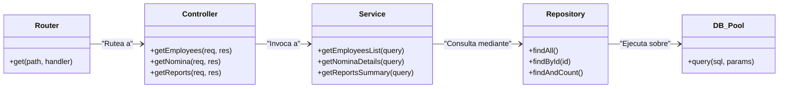
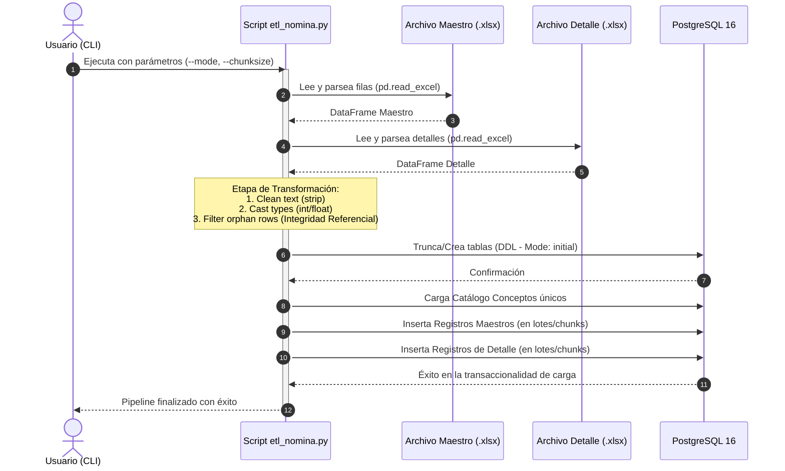
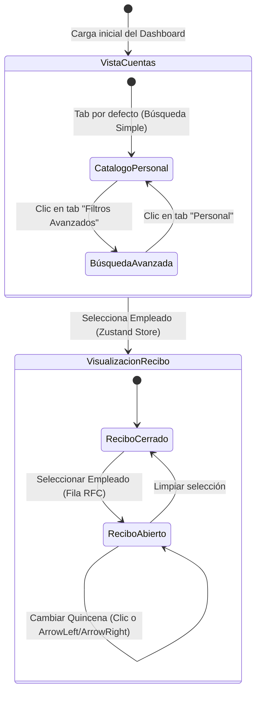

# Sistema de Auditoría y Consulta de Nóminas (SEP 2018)

Este repositorio contiene una solución completa de ingeniería de datos y desarrollo de software para procesar, consultar y visualizar la nómina pública de personal gubernamental/educativo (correspondiente a la quincena 06 de 2018 — segunda quincena de marzo de 2018).

---

## Estado del Proyecto

| Indicador | Estado |
|---|---|
| **CI (Integración Continua)** |  |
| **CD (Despliegue Continuo)** |  |
| **Documentación de API** | [](http://localhost:3000/api/docs) |
| **Licencia** | [](https://opensource.org/licenses/MIT) |
| **Docker** | [](#cómo-ejecutar-con-docker) |
| **Cobertura de tests** | **98.76 % statements · 100 % funciones** |

---

## Arquitectura del Sistema

El siguiente diagrama muestra el flujo de datos y la relación entre los distintos módulos del ecosistema:



---

## Contexto de los Datos

Los datos de entrada constan de dos archivos Excel:
* **`archivo_1.xlsx` (Maestro):** Registros de pago únicos por plaza contable. Incluye la clave RFC, nombre del empleado, adscripción (Unidad/Subunidad/Centro de Trabajo) e importes totales agrupados.
* **`archivo_2.xlsx` (Detalle):** Desglose concepto por concepto (percepciones y deducciones como sueldo base, ISR, seguridad social, seguros de vida) ligados al maestro por consecutivo.

### Diagrama UML de Entidad-Relación (ERD)

La estructura física del esquema relacional diseñado e indexado en PostgreSQL se detalla en el siguiente modelo de datos (notación Crow's Foot):



---

## Seguridad y acceso a los datos

* **Datos de acceso público:** Todos los endpoints expuestos en el backend son de solo lectura (métodos `GET`) y operan sobre información de nómina que es de carácter gubernamental público (SEP 2018).
* **Ausencia de autenticación:** Al tratarse de datos abiertos y de libre consulta, no se implementó un mecanismo de autenticación en este proyecto.
* **Escalabilidad de seguridad:** En caso de migrar a un entorno corporativo o con datos privados, se requeriría incorporar un middleware de autenticación (por ejemplo, JWT con OAuth2) y autorización basada en roles (RBAC) para restringir el acceso a los registros.

---

## Estructura del Repositorio

El proyecto está diseñado bajo una arquitectura modular y limpia:

```text
nominas/
├── docker-compose.yml         → Orquesta PostgreSQL, backend y frontend
├── README.md                  → Esta guía general de inicio rápido
├── raw_data/                  → Almacena los archivos excel originales
│
├── .github/
│   ├── workflows/
│   │   ├── ci.yml             → Pipeline CI: lint, typecheck, tests y build
│   │   └── cd.yml             → Pipeline CD: build Docker + push a GHCR
│   ├── ISSUE_TEMPLATE/        → Plantillas para Bugs y Features
│   └── PULL_REQUEST_TEMPLATE.md → Plantilla de revisión para PRs
│
├── etl/                       → MÓDULO PYTHON (ETL)
│   ├── etl_nomina.py          → Script ETL de producción parametrizado
│   └── tests/                 → Pruebas unitarias de las transformaciones
│
├── backend/                   → MÓDULO NODE.JS (API REST)
│   ├── src/
│   │   ├── controllers/       → Lógica de control y mapeo HTTP
│   │   ├── services/          → Lógica de negocio y construcción de filtros
│   │   ├── repositories/      → Acceso y consultas directas SQL
│   │   ├── routes/            → Definición de rutas Express
│   │   ├── middleware/        → Logger (Pino) y manejador de errores
│   │   ├── config/db.js       → Pool de conexiones PostgreSQL
│   │   ├── config/swagger.js  → Configuración de Swagger OpenAPI
│   │   └── __tests__/         → Suite de tests (96 tests)
│   ├── eslint.config.js       → Configuración de ESLint (Flat Config)
│   ├── Dockerfile             → Imagen multi-stage para producción
│   └── README.md              → Documentación detallada de endpoints
│
└── frontend/                  → MÓDULO REACT (DASHBOARD)
    ├── src/                   → Vistas, componentes contables y hooks de react-query
    ├── Dockerfile             → Imagen Nginx para producción
    └── README.md              → Guía de compilación del frontend
```

### Diagrama de Clases UML (Arquitectura de 3 Capas - Backend)

El backend sigue estrictamente el principio de separación de responsabilidades a través de tres capas desacopladas, lo cual permite mockear fácilmente y testear de forma aislada:



---

## Variables de Entorno

El proyecto se configura dinámicamente mediante las siguientes variables de entorno:

### Backend (`backend/.env`)

| Variable | Descripción | Valor por Defecto |
|---|---|---|
| `PORT` | Puerto de escucha de la API REST | `3000` |
| `PGHOST` | Servidor de base de datos PostgreSQL | `localhost` |
| `PGPORT` | Puerto de base de datos PostgreSQL | `5433` |
| `PGUSER` | Usuario de base de datos PostgreSQL | `postgres` |
| `PGPASSWORD` | Contraseña de base de datos PostgreSQL | `postgres_password` |
| `PGDATABASE` | Nombre de la base de datos | `nominas` |
| `CORS_ORIGIN` | Orígenes CORS permitidos | `*` |
| `LOG_LEVEL` | Nivel mínimo para logger (Pino) | `info` |

### Frontend (`frontend/.env`)

| Variable | Descripción | Valor por Defecto |
|---|---|---|
| `VITE_API_URL` | Endpoint base de la API REST del backend | `http://localhost:3000` |

---

## Cómo Ejecutar con Docker (Recomendado)

Puedes inicializar todo el ecosistema (Base de Datos + API REST + Dashboard Frontend) en segundo plano con un solo comando:

```bash
docker compose up -d
```

| Servicio | URL |
|---|---|
| **Dashboard Frontend** | [http://localhost:80](http://localhost:80) |
| **API REST Backend** | [http://localhost:3000](http://localhost:3000) |
| **Documentación de API (Swagger)** | [http://localhost:3000/api/docs](http://localhost:3000/api/docs) |
| **Base de Datos (PostgreSQL)** | `localhost:5433` |

*Nota: Una vez levantado el entorno, debes ejecutar el ETL para poblar la base de datos (ver Paso 2 en la sección siguiente).*

---

## Cómo Ejecutar de Forma Local (Desarrollo)

### Diagrama de Secuencia UML (Proceso del ETL Pipeline)

El ciclo de vida del pipeline ETL de Python (Extracción, Limpieza y Transformación en funciones puras y Carga en lotes) se ilustra en el siguiente diagrama:



### Instrucciones de ejecución local:

#### 1. Levantar Base de Datos
```bash
docker compose up -d db
```

#### 2. Ejecutar Pipeline ETL (Python)
```bash
# Crear entorno virtual e instalar librerías
python3 -m venv .venv
source .venv/bin/activate
pip install -r etl/requirements.txt

# Correr el pipeline ETL (limpia, valida y carga 292k registros en ~35 segundos)
python etl/etl_nomina.py --mode initial --chunksize 10000
```

#### 3. Ejecutar API REST (Node.js)
```bash
cd backend
npm install
npm run dev
```

#### 4. Ejecutar Dashboard Frontend (React)
```bash
cd frontend
npm install
npm run dev
```

---

## Endpoints Disponibles (API)

A continuación se detallan las rutas principales expuestas por la API REST:

* **`GET /health`** - Chequeo de estado de salud del sistema.
* **`GET /api/docs`** - Interfaz de documentación interactiva de Swagger/OpenAPI.
* **`GET /api/empleados`** - Lista paginada y filtrable de empleados ordenados por nombre.
* **`GET /api/empleados/:rfc`** - Historial detallado de recibos del empleado asociado a un RFC.
* **`GET /api/nomina`** - Consulta estructurada de recibos de nómina con soporte de 32 filtros combinados y resumen de acumulados.
* **`GET /api/nomina/:num_cons`** - Desglose de percepciones y deducciones de un recibo específico.
* **`GET /api/reportes/por-unidad`** - Acumulados financieros agrupados por unidad y/o subunidad organizativa.
* **`GET /api/reportes/conceptos`** - Sumatorias acumuladas globales para cada concepto de nómina.

---

## Testing

### Backend (Vitest + Supertest)

```bash
cd backend
npm test               # Ejecutar los 96 tests una vez
npm run test:watch     # Ejecutar tests en modo watch
npm run test:coverage  # Generar reporte de cobertura de código
```

### Frontend (Vitest + React Testing Library)

```bash
cd frontend
npm test               # Ejecutar los 7 tests de componentes
```

### ETL (Pytest)

```bash
PYTHONPATH=. pytest etl/tests/ # Ejecutar los 5 tests de transformaciones
```

---

## Características de Diseño Contable (Dashboard)

### Diagrama de Estados UML (Navegación y Estados en React)

El flujo de estados y transiciones en la interfaz contable del frontend (dashboard) gestionada por Zustand se describe a continuación:



### Detalles de la interfaz:
* **Filtro de Quincenas Integrado:** La línea de tiempo superior simula talonarios perforados físicos. Puedes moverte entre periodos haciendo clic o usando las **flechas izquierda/derecha de tu teclado**.
* **Visualización de Balances:** Gráficas con la paleta contable tradicional (verde papel de fondo, tinta índigo, percepciones en oro y deducciones en rojo).
* **Talón de Pago Digitalizado:** Al hacer clic en un empleado, el sistema renderiza un recibo de nómina con bordes perforados en CSS, desgloses detallados y soporte nativo para impresión.
* **Seguridad y Accesibilidad:** Enmascaramiento preventivo de RFCs en logs y analítica, cifras monoespaciadas para correcta alineación y manejo fluido del estado asíncrono con React Query.
