# Payroll Audit and Query System (SEP 2018)

This repository contains a complete data engineering and software development solution to process, query, and visualize public payroll data for government/education personnel (corresponding to biweekly period 06 of 2018 — second biweekly period of March 2018).

---

## Project Status

| Indicator | Status |
|---|---|
| **CI (Continuous Integration)** |  |
| **CD (Continuous Deployment)** |  |
| **API Documentation** | [](http://localhost:3000/api/docs) |
| **License** | [](https://opensource.org/licenses/MIT) |
| **Docker** | [](#how-to-run-with-docker-recommended) |
| **Commit Quality** | **Conventional (Husky + Commitlint)** |
| **Governance** | **ADRs (docs/decisions) & Release-it** |
| **Test Coverage (Backend)** | **100 % green (97 unit tests)** |


---

## System Architecture

The following diagram shows the data flow and the relationship between the different modules of the ecosystem, including the Redis caching layer, Prometheus/Grafana monitoring, and Sentry exception tracking:

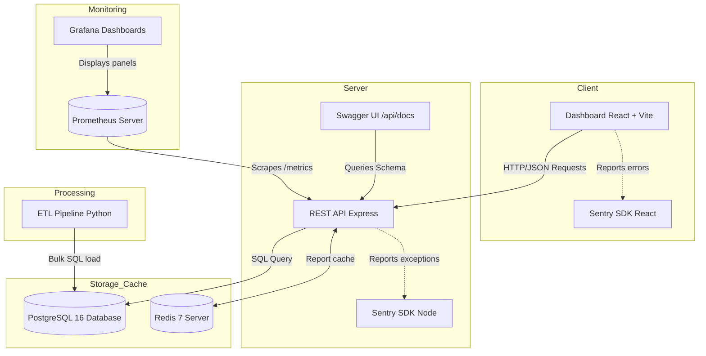
```mermaid
graph TD
    subgraph Client
        A[Dashboard React + Vite]
        S_Front[Sentry SDK React]
    end
    subgraph Server
        B[REST API Express]
        E[Swagger UI /api/docs]
        S_Back[Sentry SDK Node]
    end
    subgraph Storage_Cache
        C[(PostgreSQL 16 Database)]
        R[(Redis 7 Server)]
    end
    subgraph Monitoring
        P[(Prometheus Server)]
        G[Grafana Dashboards]
    end
    subgraph Processing
        D[ETL Pipeline Python]
    end

    A -->|HTTP/JSON Requests| B
    A -.->|Reports errors| S_Front
    B -->|SQL Query| C
    B <-->|Report cache| R
    B -.->|Reports exceptions| S_Back
    E -->|Queries Schema| B
    D -->|Bulk SQL load| C
    P -->|Scrapes /metrics| B
    G -->|Displays panels| P
```

---

## Data Context

The input data consists of two Excel files:
* **`archivo_1.xlsx` (Master):** Unique payment records per accounting position. Includes RFC key, employee name, assignment (Unit/Subunit/Work Center), and grouped total amounts.
* **`archivo_2.xlsx` (Detail):** Item-by-item breakdown (earnings and deductions such as base salary, income tax (ISR), social security, life insurance) linked to the master record by consecutive number.

### Entity-Relationship UML Diagram (ERD)

The physical structure of the relational schema designed and indexed in PostgreSQL is detailed in the following data model (Crow's Foot notation):

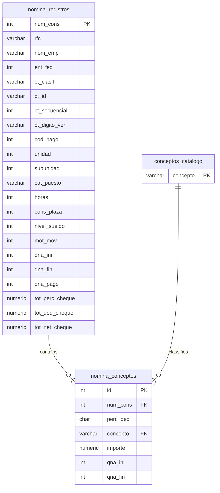
```mermaid
erDiagram
    conceptos_catalogo {
        varchar concepto PK
    }
    nomina_registros {
        int num_cons PK
        varchar rfc
        varchar nom_emp
        int ent_fed
        varchar ct_clasif
        varchar ct_id
        int ct_secuencial
        varchar ct_digito_ver
        int cod_pago
        int unidad
        int subunidad
        varchar cat_puesto
        int horas
        int cons_plaza
        int nivel_sueldo
        int mot_mov
        int qna_ini
        int qna_fin
        int qna_pago
        numeric tot_perc_cheque
        numeric tot_ded_cheque
        numeric tot_net_cheque
    }
    nomina_conceptos {
        int id PK
        int num_cons FK
        char perc_ded
        varchar concepto FK
        numeric importe
        int qna_ini
        int qna_fin
    }

    nomina_registros ||--o{ nomina_conceptos : "contains"
    conceptos_catalogo ||--o{ nomina_conceptos : "classifies"
```

---

## Security and Data Access

* **JWT Authentication:** access to the viewer requires logging in. Login issues a JWT in an `httpOnly` cookie (stateless on the server) and all routes under `/api/empleados`, `/api/nomina`, and `/api/reportes` require an active session.
* **Roles:** there are two roles, `admin` and `usuario`. Administrative routes (`/api/admin/*`, including the security log) require the `admin` role.
* **Brute-force protection:** after 5 failed login attempts within 15 minutes, the account is temporarily locked (counter stored in Redis), in addition to general per-IP rate limiting.
* **Security logs:** every login (successful/failed), logout, unauthorized access, access denied by role, and profile change is recorded in the `logs_seguridad` table with a severity level (`INFO`/`WARNING`/`ERROR`/`DEBUG`), never exposing passwords or tokens in the logs.
* **Details and evidence:** the full design is documented in [`docs/decisions/0004-autenticacion-jwt-y-logs-seguridad.md`](docs/decisions/0004-autenticacion-jwt-y-logs-seguridad.md) (which supersedes the original no-authentication decision, [`docs/decisions/0001-sin-autenticacion.md`](docs/decisions/0001-sin-autenticacion.md)), with practical evidence in [`docs/evidencias-practicas-logs.md`](docs/evidencias-practicas-logs.md).

---

## Repository Structure

The project is designed under a clean, modular architecture:

```text
nominas/
├── docker-compose.yml         → Orchestrates PostgreSQL, Redis, Prometheus, Grafana, backend, and frontend
├── prometheus.yml             → Configures metric scrape intervals for Prometheus
├── README.md                  → This general quick-start guide
├── commitlint.config.js       → Rules for validating conventional commit messages
├── .release-it.json           → Configuration for generating releases, tags, and changelogs
├── .husky/                    → Git hooks (pre-commit and commit-msg) for quality control
├── raw_data/                  → Stores the original Excel files (excluded from commits)
│
├── .github/
│   ├── workflows/
│   │   ├── ci.yml             → CI pipeline: lint, typecheck, tests, secret scanning, and build
│   │   └── cd.yml             → CD pipeline: Docker build + push to GHCR
│   ├── ISSUE_TEMPLATE/        → Templates for Bugs and Features
│   └── PULL_REQUEST_TEMPLATE.md → Review template for PRs
│
├── docs/                      → GENERAL DOCUMENTATION
│   └── decisions/             → Architecture Decision Records (ADRs)
│
├── etl/                       → PYTHON MODULE (ETL)
│   ├── etl_nomina.py          → Production ETL script (validates and loads into the database)
│   └── tests/                 → Unit tests for the transformations
│
├── backend/                   → NODE.JS MODULE (REST API)
│   ├── migrations/            → Versioned DDL database migrations (node-pg-migrate)
│   ├── src/
│   │   ├── controllers/       → Control logic and HTTP mapping
│   │   ├── services/          → Business logic, dynamic filters, and Redis caching
│   │   ├── repositories/      → Direct SQL access and queries
│   │   ├── routes/            → Express route definitions with specific rate limiters
│   │   ├── middleware/        → Logger, error handler, metrics, and validateRequest (Zod)
│   │   ├── schemas/           → Strict parameter validation schemas using Zod
│   │   ├── config/db.js       → PostgreSQL connection pool
│   │   ├── config/env.js      → Strict fail-fast environment variable validator
│   │   ├── config/redis.js    → Redis cache client and helpers
│   │   ├── config/swagger.js  → Swagger OpenAPI configuration
│   │   ├── utils/             → JWT signing/verification and security event logger
│   │   └── __tests__/         → Test suite (117 tests with database mocks)
│   ├── eslint.config.js       → ESLint configuration (Flat Config)
│   ├── Dockerfile             → Multi-stage image for production
│   └── README.md              → Detailed endpoint documentation
│
└── frontend/                  → REACT MODULE (DASHBOARD)
    ├── src/                   → Views, components, error tracking with Sentry
    ├── Dockerfile             → Nginx image for production
    └── README.md              → Frontend build guide
```

### UML Class Diagram (3-Layer Backend Architecture)

The backend follows the separation-of-concerns principle across three decoupled layers, interacting resiliently with Redis and reporting uncaught exceptions to Sentry:

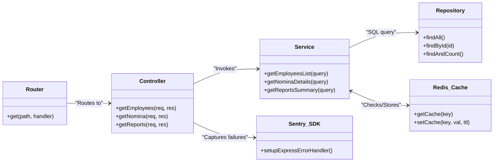
```mermaid
classDiagram
    direction LR
    class Router {
        +get(path, handler)
    }
    class Controller {
        +getEmployees(req, res)
        +getNomina(req, res)
        +getReports(req, res)
    }
    class Service {
        +getEmployeesList(query)
        +getNominaDetails(query)
        +getReportsSummary(query)
    }
    class Repository {
        +findAll()
        +findById(id)
        +findAndCount()
    }
    class Redis_Cache {
        +getCache(key)
        +setCache(key, val, ttl)
    }
    class Sentry_SDK {
        +setupExpressErrorHandler()
    }

    Router --> Controller : "Routes to"
    Controller --> Service : "Invokes"
    Service --> Repository : "SQL query"
    Service <--> Redis_Cache : "Checks/Stores"
    Controller --> Sentry_SDK : "Captures failures"
```

---

## Environment Variables

The project is configured dynamically through the following environment variables:

### Backend (`backend/.env`)

| Variable | Description | Default Value |
|---|---|---|
| `PORT` | REST API listening port | `3000` |
| `PGHOST` | PostgreSQL database server | `localhost` |
| `PGPORT` | PostgreSQL database port | `5433` |
| `PGUSER` | PostgreSQL database user | `postgres` |
| `PGPASSWORD` | PostgreSQL database password | `postgres_password` |
| `PGDATABASE` | Database name | `nominas` |
| `CORS_ORIGIN` | Allowed CORS origins | `*` |
| `REDIS_URL` | Connection URL for the Redis cache store | `redis://localhost:6379` |
| `SENTRY_DSN` | Sentry DSN for error tracking in production | `""` |
| `LOG_LEVEL` | Minimum level for the logger (Pino) | `info` |
| `JWT_SECRET` | Secret key for signing and verifying session JWTs | *(required in production)* |
| `JWT_EXPIRES_IN` | Session JWT expiration time | `2h` |

### Frontend (`frontend/.env`)

| Variable | Description | Default Value |
|---|---|---|
| `VITE_API_URL` | Base endpoint of the backend REST API | `http://localhost:3000` |
| `VITE_SENTRY_DSN` | Sentry DSN for the React dashboard | `""` |

---

## How to Run with Docker (Recommended)

You can start the entire ecosystem (Database + Redis + Prometheus + Grafana + REST API + Frontend Dashboard) in the background with a single command:

```bash
docker compose up -d
```

| Service | URL |
|---|---|
| **Frontend Dashboard** | [http://localhost:80](http://localhost:80) |
| **Backend REST API** | [http://localhost:3000](http://localhost:3000) |
| **Swagger Docs** | [http://localhost:3000/api/docs](http://localhost:3000/api/docs) |
| **Metrics (Prometheus-compatible)** | [http://localhost:3000/metrics](http://localhost:3000/metrics) |
| **Prometheus Server** | [http://localhost:9090](http://localhost:9090) |
| **Grafana Panels** (User: `admin` / Pwd: `admin`) | [http://localhost:3001](http://localhost:3001) |
| **Database (PostgreSQL)** | `localhost:5433` |
| **Redis Server** | `localhost:6379` |

*Note: Once the environment is up, you must run the ETL to populate the database (see Step 2 in the next section).*

#### Monitoring, Observability, and Exception Reporting

##### Monitoring with Prometheus and Grafana
Grafana comes pre-configured to connect to Prometheus and automatically loads the production dashboard "Auditoría de Nóminas - NodeJS Metrics" to monitor latency, RPS, status codes, CPU, and memory:

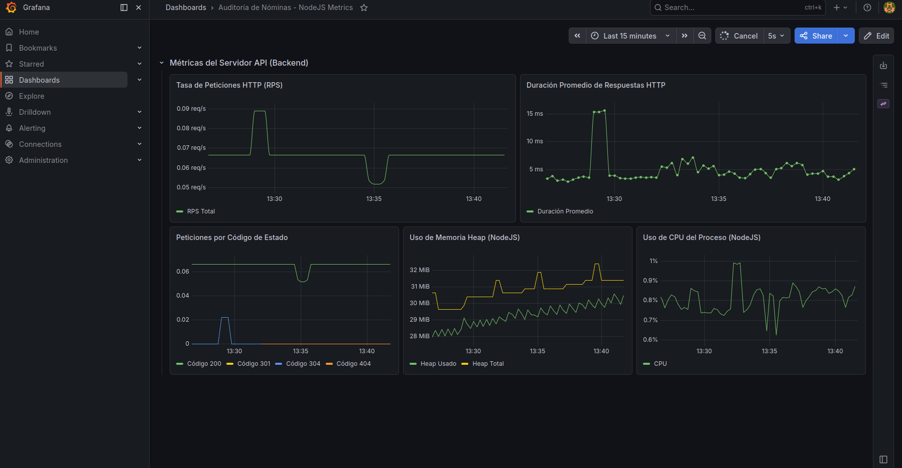

##### Exception Reporting with Sentry
The project integrates Sentry in both the frontend and backend to report and track uncaught errors in real time in production environments:

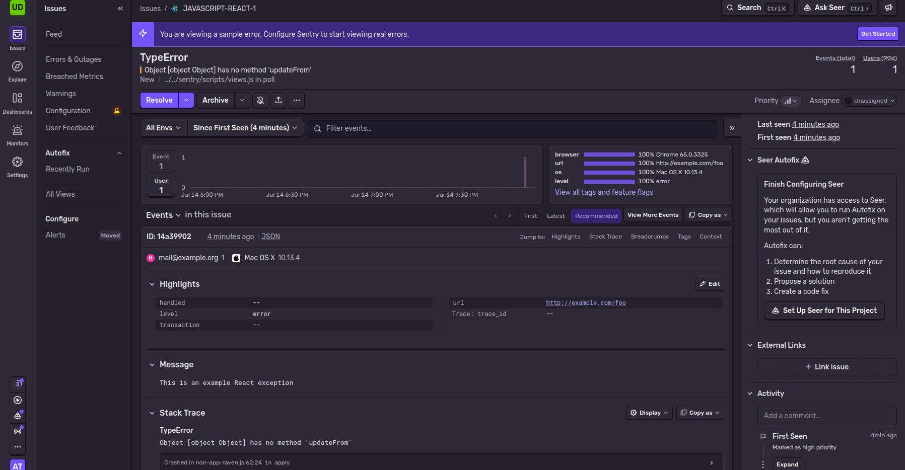

---

## How to Run Locally (Development)

### UML Sequence Diagram (ETL Pipeline Process)

The lifecycle of the Python ETL pipeline (Extraction, Cleaning and Transformation in pure functions, and Loading in batches with optimized indexes) is illustrated in the following diagram:

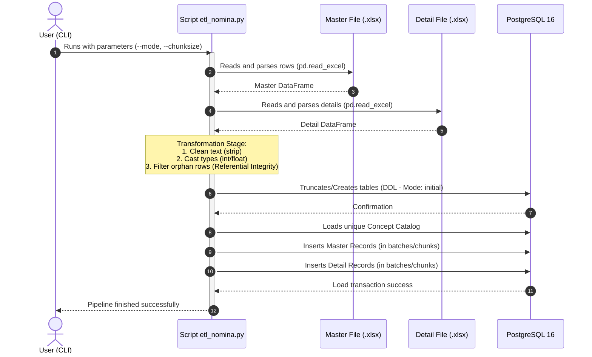
```mermaid
sequenceDiagram
    autonumber
    actor CLI as User (CLI)
    participant ETL as Script etl_nomina.py
    participant Excel1 as Master File (.xlsx)
    participant Excel2 as Detail File (.xlsx)
    participant DB as PostgreSQL 16

    CLI->>ETL: Runs with parameters (--mode, --chunksize)
    activate ETL
    ETL->>Excel1: Reads and parses rows (pd.read_excel)
    Excel1-->>ETL: Master DataFrame
    ETL->>Excel2: Reads and parses details (pd.read_excel)
    Excel2-->>ETL: Detail DataFrame
    Note over ETL: Transformation Stage:<br/>1. Clean text (strip)<br/>2. Cast types (int/float)<br/>3. Filter orphan rows (Referential Integrity)
    ETL->>DB: Truncates/Creates tables (DDL - Mode: initial)
    DB-->>ETL: Confirmation
    ETL->>DB: Loads unique Concept Catalog
    ETL->>DB: Inserts Master Records (in batches/chunks)
    ETL->>DB: Inserts Detail Records (in batches/chunks)
    DB-->>ETL: Load transaction success
    ETL-->>CLI: Pipeline finished successfully
    deactivate ETL
```

### Local execution instructions:

#### 1. Start Required Services (DB and Redis)
```bash
docker compose up -d db redis
```

#### 2. Run the ETL Pipeline (Python)
```bash
# Create a virtual environment and install libraries
python3 -m venv .venv
source .venv/bin/activate
pip install -r etl/requirements.txt

# Run the ETL pipeline (cleans, validates, and loads 292k records in ~35 seconds and indexes the database)
python etl/etl_nomina.py --mode initial --chunksize 10000
```

#### 3. Run the REST API (Node.js)
```bash
cd backend
npm install
npm run dev
```

#### 4. Run the Frontend Dashboard (React)
```bash
cd frontend
npm install
npm run dev
```

---

## Available Endpoints (API)

The main routes exposed by the REST API are detailed below:

* **`GET /health`** - Enhanced system health check (DB status, uptime, memory usage).
* **`GET /metrics`** - Exposes global system metrics in Prometheus format (HTTP requests, response durations).
* **`GET /api/docs`** - Interactive Swagger/OpenAPI documentation interface.
* **`POST /api/auth/login`** - Logs in and issues a JWT in an `httpOnly` cookie (public, with strict rate-limiting and lockout after 5 failed attempts).
* **`POST /api/auth/logout`** - Ends the current session.
* **`GET /api/auth/me`** - Returns the authenticated user.
* **`PATCH /api/auth/profile`** - Updates one's own `nombre` or `email` and audits the change.
* **`GET /api/admin/logs-seguridad`** - Queries the security event log (requires `admin` role).

#### Interactive Documentation with Swagger

The backend exposes the OpenAPI specification for all its endpoints interactively at `/api/docs`:

| Endpoints View in Swagger | Models and Parameters Detail |
| :---: | :---: |
| 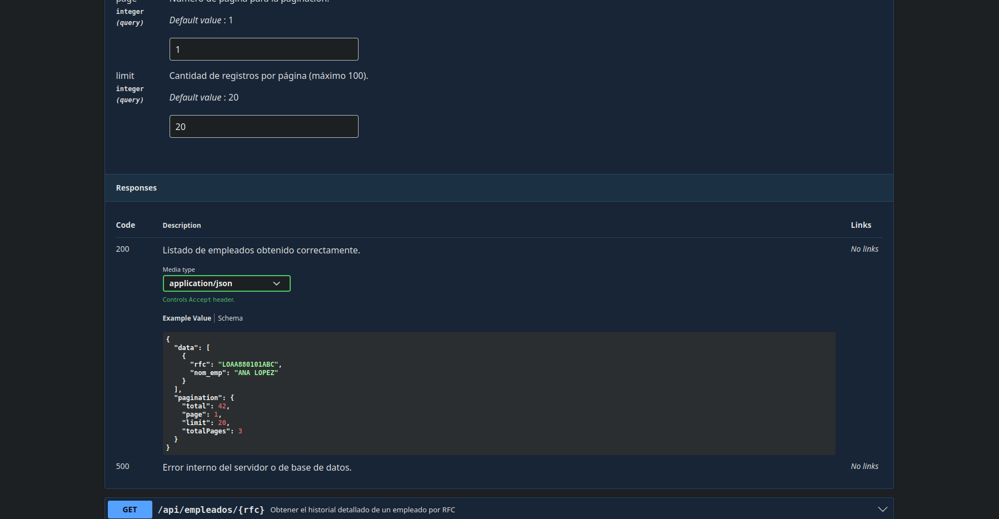 | 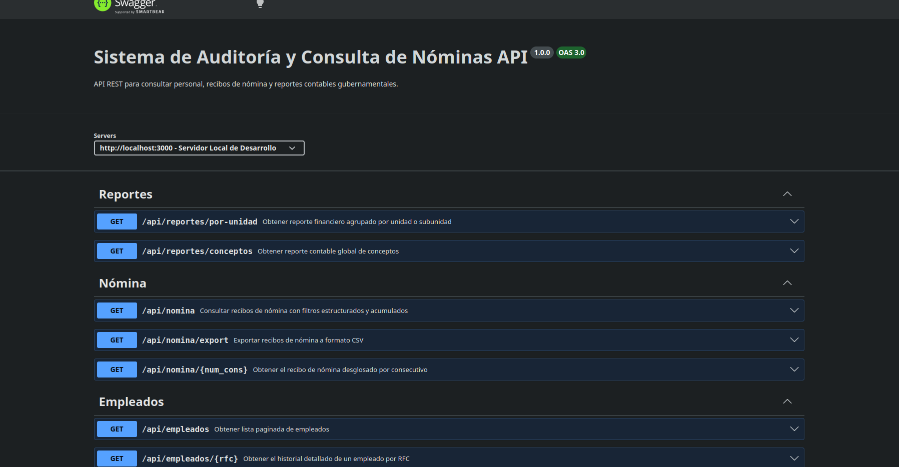 |

The following routes require an active session (any role):

* **`GET /api/empleados`** - Paginated and filterable list of employees ordered by name.
* **`GET /api/empleados/:rfc`** - Detailed receipt history for the employee associated with an RFC.
* **`GET /api/nomina`** - Structured payroll receipt query with support for 32 combined filters and accumulated summary.
* **`GET /api/nomina/:num_cons`** - Breakdown of earnings and deductions for a specific receipt.
* **`GET /api/reportes/por-unidad`** - Financial totals grouped by unit and/or subunit (cached in Redis with a 10-minute TTL).
* **`GET /api/reportes/conceptos`** - Global accumulated sums for each payroll concept (cached in Redis with a 10-minute TTL).

---

## Governance, Quality, and Stability

The project incorporates a modern ecosystem to ensure code quality, versioning, and deployment control:

1. **Versioned Migrations**: Schema and index creation in PostgreSQL is separated from the ETL script and managed by `node-pg-migrate` under `backend/migrations/`. The backend container runs them automatically on startup.
2. **Validation with Zod**: All query and route parameters (such as `num_cons`) in the endpoints are strictly validated at runtime. Errors are formatted into standardized `400 Bad Request` responses to improve security and consistency.
3. **Commit Quality (Git Hooks)**: Configured with `husky` and `lint-staged`. Every conventional commit is validated by `commitlint`, ensuring adherence to the conventional commits standard. Additionally, `lint-staged` runs linters (ESLint and Oxlint) and local unit tests to prevent unstable code from entering the Git history.
4. **Architecture Decision Records (ADRs)**: Fundamental technical decisions for the portfolio are documented in `docs/decisions/` to make design assumptions transparent and ease onboarding for collaborators.
5. **Automated Releases**: Integrates `release-it` to semantically version the application (`patch`, `minor`, `major`), automatically update `CHANGELOG.md` from conventional commits, create Git tags, and publish the release on GitHub.

---

## Testing

### Backend (Vitest + Supertest)

```bash
cd backend
npm test               # Run the 117 tests once
npm run test:watch     # Run tests in watch mode
npm run test:coverage  # Generate code coverage report
```

### Frontend (Vitest + React Testing Library)

```bash
cd frontend
npm test               # Run the 18 component tests
```

### ETL (Pytest)

```bash
cd etl
PYTHONPATH=.. .venv/bin/pytest # Run the 5 transformation tests
```

---

## Accounting Design Features (Dashboard)

### Interface Screenshots

| Main Dashboard View | Advanced Search and Balances |
| :---: | :---: |
| 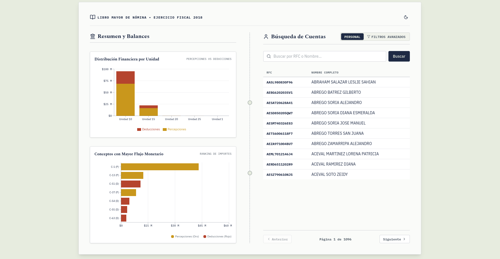 | 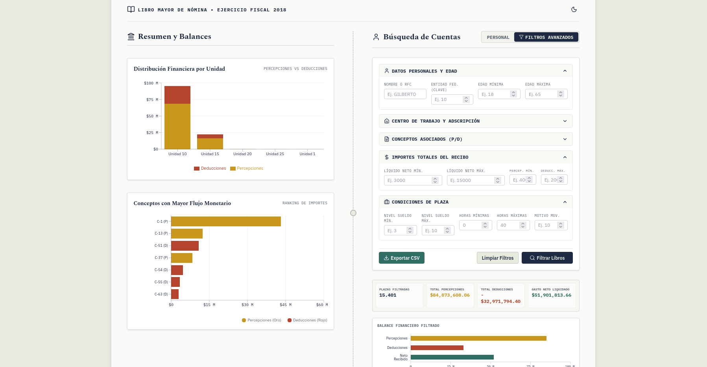 |

| Receipt Detail View | PDF Print View | Dashboard in Dark Mode |
| :---: | :---: | :---: |
| 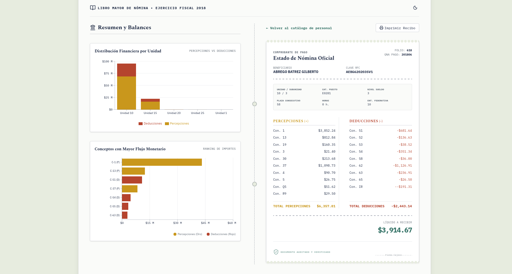 | 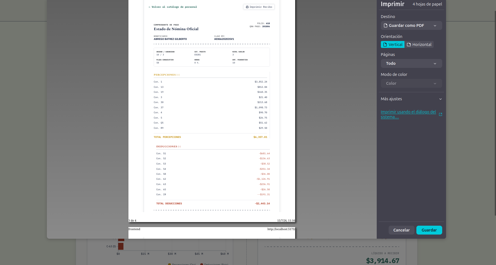 | 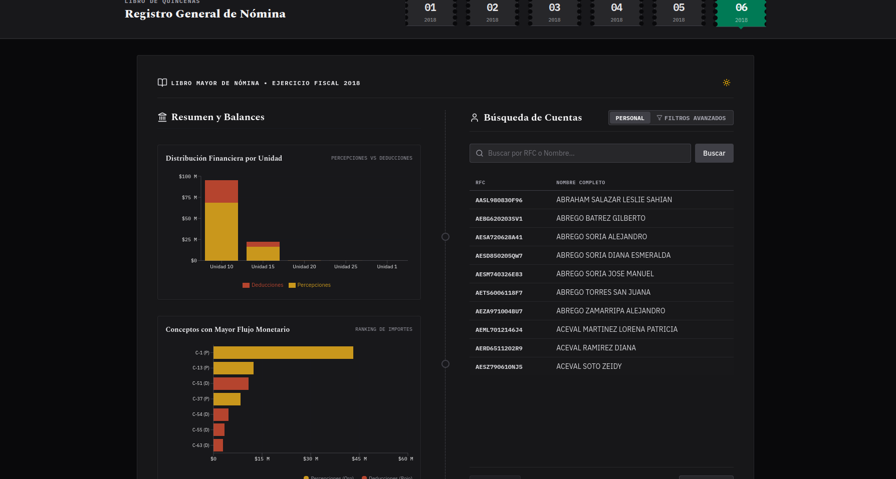 |

### Authentication and Roles

| Login Screen | Invalid Credentials Error |
| :---: | :---: |
| 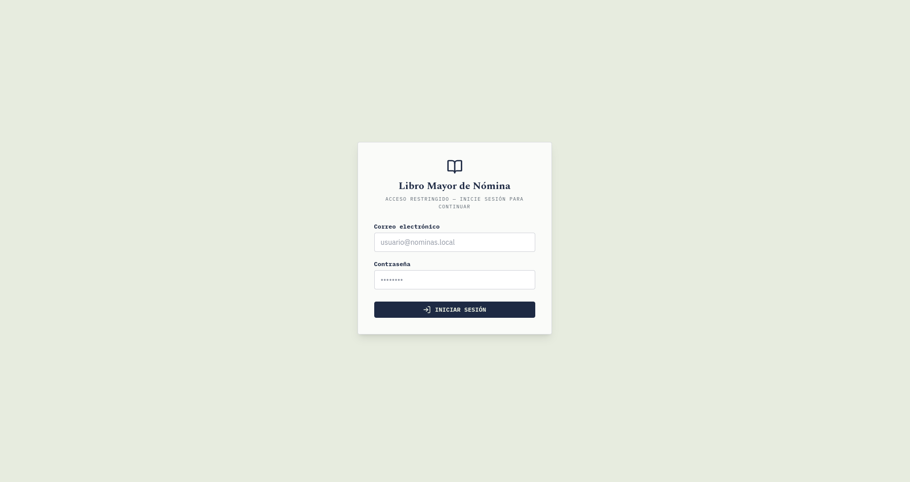 | 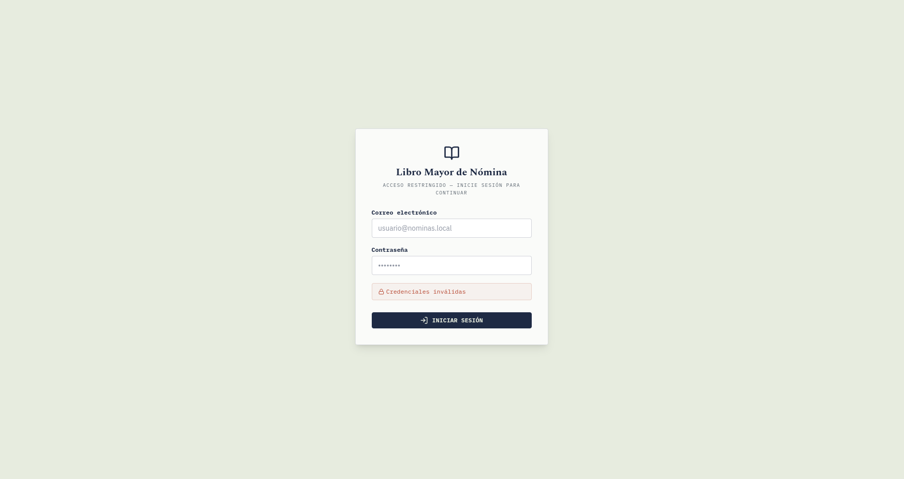 |

| Admin Dashboard (with security log) | User Dashboard (without admin panel) |
| :---: | :---: |
|  | 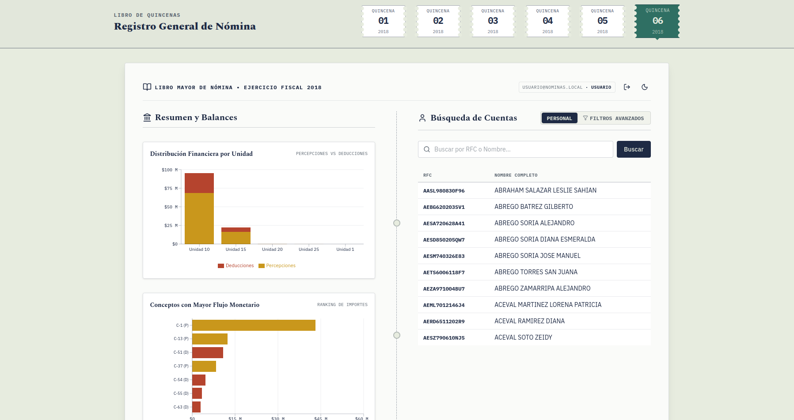 |

### UML State Diagram (Navigation and States in React)

The flow of states and transitions in the frontend accounting interface (dashboard), managed by Zustand, is described below:

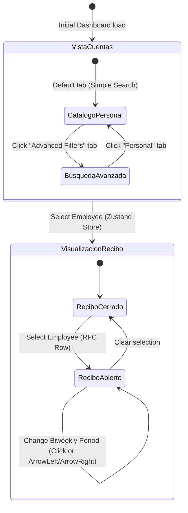
```mermaid
stateDiagram-v2
    [*] --> VistaCuentas : Initial Dashboard load

    state VistaCuentas {
        [*] --> CatalogoPersonal : Default tab (Simple Search)
        CatalogoPersonal --> BúsquedaAvanzada : Click "Advanced Filters" tab
        BúsquedaAvanzada --> CatalogoPersonal : Click "Personal" tab
    }

    state VisualizacionRecibo {
        [*] --> ReciboCerrado
        ReciboCerrado --> ReciboAbierto : Select Employee (RFC Row)
        ReciboAbierto --> ReciboAbierto : Change Biweekly Period (Click or ArrowLeft/ArrowRight)
        ReciboAbierto --> ReciboCerrado : Clear selection
    }

    VistaCuentas --> VisualizacionRecibo : Select Employee (Zustand Store)
```

### Interface Details:
* **Integrated Biweekly Period Filter:** The top timeline simulates physical perforated check stubs. You can move between periods by clicking or using the **left/right arrow keys on your keyboard**.
* **Balance Visualization:** Charts with the traditional accounting palette (green paper background, indigo ink, earnings in gold and deductions in red).
* **Digitized Pay Stub:** When you click an employee, the system renders a payroll receipt with CSS-perforated edges, detailed breakdowns, and native print support.
* **Security and Accessibility:** Preventive masking of RFCs in logs and analytics, monospaced figures for proper alignment, and smooth asynchronous state handling with React Query.
